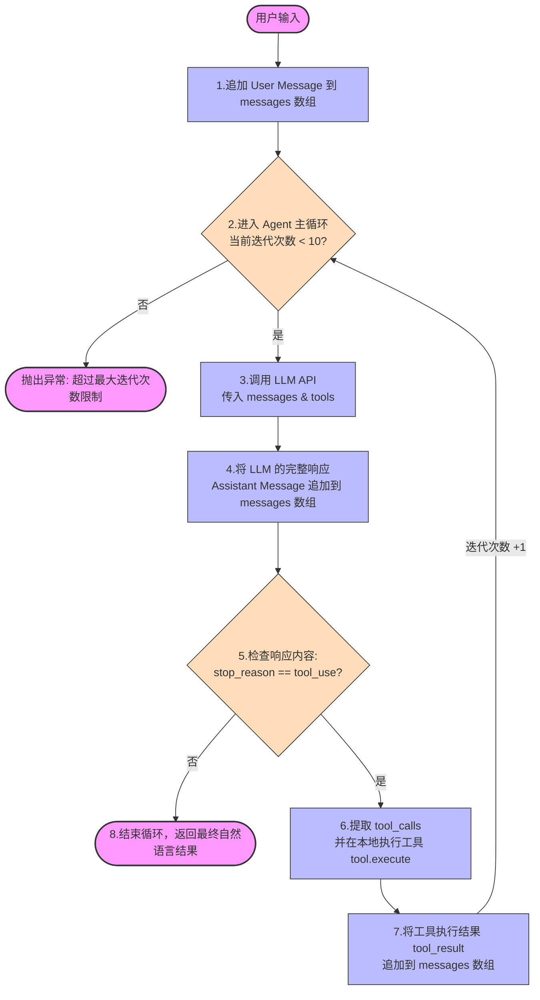

# Nano Agent

> 基于 Claude Code 核心原理的最简智能体实现

## 概述

Nano Agent 是一个极简的 AI 智能体实现，它从 Claude Code v2.1.88 的源码中提炼出核心工作原理，用 TypeScript 重写为一个可独立运行的项目。

## 核心特性

- 🎯 **Agent 循环** - 用户输入 → LLM → 工具执行 → 回到 LLM
- 🔧 **可扩展工具系统** - 内置 5 个实用工具，易于添加新工具
- 💬 **消息历史管理** - 完整的对话上下文保留
- ⚡ **异步生成器输出** - 实时流式响应
- 📦 **零运行时依赖** - 仅使用 Node.js 内置模块

## 快速开始

### 前置要求

- Node.js >= 18.0.0
- 一个兼容 OpenAI API 的 LLM 服务（如 Ollama、vLLM 等）

### 安装

```bash
cd nanoagent
npm install
```

### 配置

编辑 [`src/config.ts`](src/config.ts) 修改你的 LLM 配置：

```typescript
export const CONFIG: Config = {
  baseURL: 'http://localhost:11434/',      // 你的 API 地址
  apiKey: 'NONE',                             // API Key
  model: 'qwen3.5:9b',                       // 模型名称
  maxTokens: 256000,
}
```

### 运行

```bash
# 开发模式（使用 tsx 直接运行 TypeScript）
npm run dev "列出当前目录的文件"

# 编译为 JavaScript
npm run build

# 生产模式运行
npm start "读取 package.json"
```

## 核心工作原理

### Agent 循环流程图



### 与 Claude Code 核心原理对比

| 组件 | Claude Code | Nano Agent | 文件位置 |
|------|-------------|------------|----------|
| 主循环 | `queryLoop()` | `NanoAgent.run()` | [`src/agent.ts:20`](src/agent.ts#L20) |
| 消息历史 | `mutableMessages[]` | `messages[]` | [`src/agent.ts:8`](src/agent.ts#L8) |
| 工具系统 | `Tool` 接口 | `ToolDefinition` 接口 | [`src/types.ts:16`](src/types.ts#L16) |
| 工具执行 | `runTools()` + `StreamingToolExecutor` | 直接在循环中执行 | [`src/agent.ts:51`](src/agent.ts#L51) |
| API 调用 | `callModel()` | `chatCompletions()` | [`src/client.ts:11`](src/client.ts#L11) |
| 格式转换 | OpenAI 工具格式 | `toolsToOpenAIFormat()` | [`src/tools.ts:99`](src/tools.ts#L99) |

### 简化的部分

为了保持"最简"，Nano Agent 移除了 Claude Code 中的复杂特性：

| 特性 | Claude Code | Nano Agent | 原因 |
|------|-------------|------------|------|
| 上下文压缩 | ✅ snip/microcompact/autocompact | ❌ | 简版不需要 |
| 权限系统 | ✅ `canUseTool` + hooks | ❌ | 本地运行不需要 |
| Hook 系统 | ✅ UserPromptSubmit/PostSampling/Stop | ❌ | 增加复杂度 |
| 流式工具执行 | ✅ `StreamingToolExecutor` | ❌ | 简版同步执行即可 |
| 子代理 | ✅ fork/worktree/remote | ❌ | 单智能体足够 |
| 提示词缓存 | ✅ global/session 缓存 | ❌ | 简版不需要 |
| 预算追踪 | ✅ token budget + max turns | ⚠️ 仅 max turns | 简化实现 |

## 项目结构

```
nanoagent/
├── package.json              # NPM 配置
├── tsconfig.json             # TypeScript 配置
├── README.md                 # 本文档
└── src/
    ├── types.ts             # 类型定义
    │   ├─ Message           # 消息类型
    │   ├─ ToolDefinition    # 工具定义接口
    │   ├─ ToolParam         # 工具参数接口
    │   └─ Config            # 配置类型
    │
    ├── config.ts            # 配置 + 系统提示词
    │   ├─ CONFIG            # LLM 配置对象
    │   └─ SYSTEM_PROMPT     # 系统提示词
    │
    ├── utils.ts             # 工具函数
    │   └─ simpleGlob        # 简易 glob 实现
    │
    ├── tools.ts             # 工具定义 + 实现
    │   ├─ TOOLS[]           # 工具数组
    │   ├─ FileRead          # 读取文件
    │   ├─ FileWrite         # 写入文件
    │   ├─ Glob              # 搜索文件
    │   ├─ Bash              # 执行 Shell 命令
    │   ├─ ListDir           # 列出目录
    │   └─ toolsToOpenAIFormat()
    │
    ├── client.ts            # API 客户端
    │   └─ chatCompletions() # 调用 LLM API
    │
    ├── agent.ts             # Agent 主类
    │   └─ NanoAgent         # 核心 Agent 实现
    │      ├─ constructor()  # 初始化，添加 system message
    │      ├─ findTool()     # 根据名称查找工具
    │      └─ run()          # 主循环 (AsyncGenerator)
    │
    └── main.ts              # CLI 入口
       └─ main()             # 解析命令行参数，启动 Agent
```

## 内置工具

### FileRead
读取文件内容。

**参数：**
- `file_path` (string, 必需) - 要读取的文件路径

### FileWrite
创建新文件或完全覆盖现有文件。

**参数：**
- `file_path` (string, 必需) - 要写入的文件路径
- `content` (string, 必需) - 要写入的内容

### Glob
搜索匹配模式的文件。

**参数：**
- `pattern` (string, 必需) - glob 模式 (例如: `*.js`, `**/*.ts`)

### Bash
执行 shell 命令。

**参数：**
- `command` (string, 必需) - 要执行的 shell 命令

### ListDir
列出目录内容。

**参数：**
- `path` (string, 可选) - 目录路径 (默认为 `.`)

## 如何添加新工具

1. 在 [`src/tools.ts`](src/tools.ts) 的 `TOOLS` 数组中添加新工具定义：

```typescript
{
  name: 'MyNewTool',
  description: '工具描述',
  params: {
    param1: { type: 'string', description: '参数1描述', required: true },
    param2: { type: 'number', description: '参数2描述', required: false },
  },
  execute: async (args: Record<string, any>) => {
    const { param1, param2 = 42 } = args
    // 实现工具逻辑
    return '工具执行结果'
  },
},
```

2. 工具会自动注册到 Agent 中，无需其他配置！

## 使用示例

### 示例 1: 列出目录

```bash
npm run dev "列出当前目录的内容"
```

输出：
```
🤖 Nano Agent 正在处理...
════════════════════════════════════════════════════════════

[迭代 1/10]

[调用工具: ListDir({"path":"."})]

[工具结果]
[DIR]   src
[FILE]  package.json
[FILE]  tsconfig.json
[FILE]  README.md

[迭代 2/10]

当前目录包含以下内容：
- src/ - 源代码目录
- package.json - 项目配置文件
- tsconfig.json - TypeScript 配置文件
- README.md - 项目文档

════════════════════════════════════════════════════════════
✅ 完成
```

### 示例 2: 读取并分析文件

```bash
npm run dev "读取 package.json 并告诉我这个项目是做什么的"
```

### 示例 3: 创建文件

```bash
npm run dev "创建一个 hello.txt 文件，内容是 'Hello World'"
```

## 核心代码解读

### Agent 主循环

[`src/agent.ts:20`](src/agent.ts#L20) 中的 `run()` 方法是核心：

```typescript
async *run(userInput: string): AsyncGenerator<string, void, unknown> {
  // 1. 添加用户消息
  this.messages.push({ role: 'user', content: userInput })

  let iteration = 0
  const maxIterations = 10

  // 2. 主循环
  while (iteration < maxIterations) {
    iteration++

    // 3. 调用 LLM
    const response = await chatCompletions({
      messages: this.messages,
      tools: toolsToOpenAIFormat(TOOLS),
    })

    // 4. 处理响应
    const assistantMessage = response.choices[0].message
    this.messages.push({
      role: 'assistant',
      content: assistantMessage.content || '',
    })

    // 5. 检查是否需要工具调用
    const toolCalls = assistantMessage.tool_calls
    if (!toolCalls || toolCalls.length === 0) {
      break // 没有工具调用，结束
    }

    // 6. 执行工具
    for (const toolCall of toolCalls) {
      const tool = this.findTool(toolCall.function.name)
      const args = JSON.parse(toolCall.function.arguments)
      const result = await tool.execute(args)

      // 7. 添加工具结果
      this.messages.push({
        role: 'tool',
        tool_call_id: toolCall.id,
        name: tool.name,
        content: result,
      })
    }
  }
}
```

## 技术栈

- **TypeScript 5.0+** - 类型安全
- **ES2022** - 现代 JavaScript 特性
- **Node.js 内置模块** - `fs`, `child_process`, `path`, `url`, `util`
- **tsx** - TypeScript 运行时 (开发依赖)
- **零运行时依赖** - 生产环境不需要任何外部包

## 常见问题

### Q: 如何修改模型配置？

A: 编辑 [`src/config.ts`](src/config.ts) 中的 `CONFIG` 对象。

### Q: 可以用 OpenAI 的官方 API 吗？

A: 可以！只需修改 `baseURL` 和 `apiKey`：

```typescript
export const CONFIG: Config = {
  baseURL: 'https://api.openai.com/v1/',
  apiKey: 'sk-your-api-key-here',
  model: 'gpt-4',
  maxTokens: 256000,
}
```

### Q: 如何增加最大迭代次数？

A: 修改 [`src/agent.ts:23`](src/agent.ts#L23) 中的 `maxIterations`。

## 学习资源

想要了解 Claude Code 的完整实现？查看父目录的源码：

- [`src/query.ts`](../src/query.ts) - 主 Agent 循环
- [`src/QueryEngine.ts`](../src/QueryEngine.ts) - 会话管理
- [`src/Tool.ts`](../src/Tool.ts) - 工具系统接口
- [`src/tools/`](../src/tools/) - 40+ 内置工具实现

## 许可证

本项目基于 Claude Code v2.1.88 的反编译源码进行学习和研究。仅供技术研究、学习和教育交流使用。

---

**享受构建智能体的乐趣！** 🎉
